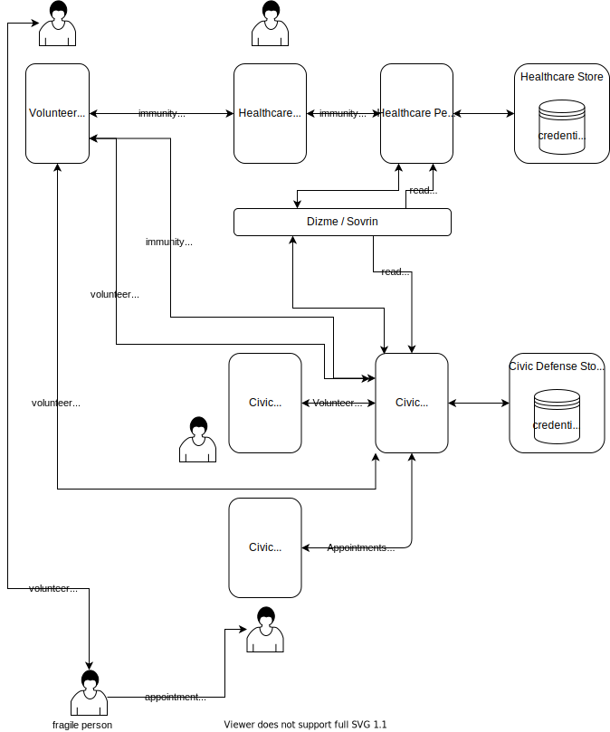

# staysafe-shielding
Covid-19 StaySafe shielding project

See Personas & user stories in https://safe-together.github.io/specification/stories/

See the general architecture requirements in https://safe-together.github.io/specification/protocol#shielding-system

This project implements a POC of [this journey](https://www.powtoon.com/c/f2AjuQcsqg0/1/m).

The main components of the Shielding System are summarized in following  picture:

- The [h-system](h-system) code realizes the healthcare  system components.
- The [p-system](p-system) code realizes the civic defense system components.

