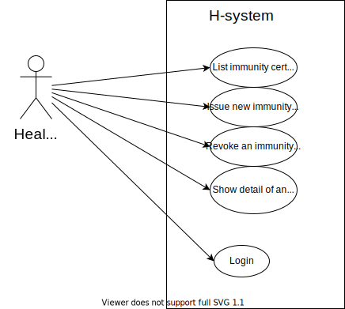

# H-System
POC for healthcare shielding application.
This application provides a way for issuing and revoking immunity certificates 


## Quickstart with docker

The project is shipped with a [Docker](https://docker.com) setup that makes it easy to get a containerized  environment up and running.


```
docker-compose up -d
```

## Use case diagram



## Project Structure

### Store

Store is a "standalone" component built with [mariaDB](https://mariadb.org/).
At startup it cretes the following table schemas.

#### Facility [TODO: is it necessary?]

Contains information about the workplace of healthcare professionals.

|code | name | address | type|
|----|:------:|:-------------:|------:|
|Identifier of the facility |name of facility | address of facility | indicates whether it's a farmacy or hospital|


#### Operator

Contains information about healthcare professionals.


| username   |      password      |  healthcareid |[facility](#facility)
|----------|:-------------:|------:| ------:|-----:|
| userame or email used for login |  SHA256 | identifier of operator in NHS |Reference


#### Certificates [TBD]

Contains information about issued certificates and the operator who issued them.

| business_id   | tid|status |    [username](#operator) 
|----------|:-------------:|:-----:|:----:|
| id of the certificate's owner | identifier of the transaction|status of the certificate| certificate's issuer 


### Api

Api is a standard [node-express](https://expressjs.com/) application. It connects the store and [Dizme](https://dizme.io/) by providing a layer of abstruction between the two. It also exposes certain routes to be used by frontend.

Given that this is a POC, admin functionalities (as shown in [user case digram](#use-case-diagram)) are not implemented yet, they will be in the integration with the NHS using their infructructure for the login.
To add new operators use Adminer (check doker-compose file).

The app is composed of two main components.
1. **DataBase Interface** which exposes the following functions:
    - setUserPassword(username, password, old_password)
    - login(username, password)
    *Operator Functions*
    - getCertificateList(username)
    - addCertificate()
    - revokeCertificate()


2. **Dizme Interface** che espone le seguenti funzioni:
    - getCertificateDetail()
    - issueCertificate()
    - revokeCertificate()


#### Routes
All routes, except for /login, are protected by [jwt](https://jwt.io/).
After login the following header must be added to every request

```Authorization : Barer YOUR_TOKEN```


Now let's take a look at the actual routes


| METHOD   |   Route |  Description | Request   |     Response
|:----------|:-----------|:-------|:----------:|:---------
| POST | /login | Login service provided by | ```{username, password}``` | ```{error, token}```
| GET | /certificates | List of issued certificates by the logged in operator. | TBD | TBD
| POST | /issue | Fires up the process of issuing an immunity certification according to the predefined schema. | TBD | TBD
| GET | /details/:business_id | Returns the details of a certificate. | TBD | TBD
| POST | /revoke/:business_id | Revokes the certificate | TBD | TBD


### Frontend

Frontend is a standard [vue-js](https://vuejs.org/) single-page application. It uses the API part for sending and retrieving data. It basically makes everything visible.

It has the following views:
1. **Login Page** pretty self explanatory. It redirects to the Dashboard (after a successful login of course)
2. **Dashboard** shows the list of all certificates issued by the logged in operator. Each list entry can be expanded to show the detail for every credential and eventually revoke it. From this page it is also possibile to issue a new certificate.
3. **Issuing Page** which contains a form to issue a new certificate with a section dedicated to showing the DIZME Widget.
4. **Details\Revoke Page** which shows the details of a certain certificate and it also permits to revoke the certificate and add the reason of revoke.